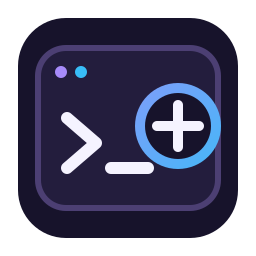

<div align="center">



# dotnet-workspace-explorer

**A .NET solution explorer for the command line and editors.**

[](#development)
[](#development)
[](https://github.com/alsi-lawr/dotnet-workspace-explorer/blob/master/LICENSE)

</div>

Workspace Explorer reads and edits .NET solutions. It works with `.sln` and `.slnx` files across
C#, F#, and Visual Basic projects. Solution filters (`.slnf`) are available as read-only views.

## Install

```console
dotnet tool install --global Dotnet.WorkspaceExplorer
```

Run it as either `dotnet-we` or `dotnet we`:

```console
dotnet-we solution ./Demo.slnx list
dotnet we solution ./Demo.slnx list
```

## Use

Add a project:

```console
dotnet-we solution ./Demo.slnx add ./src/Demo.Core/Demo.Core.csproj
```

List the projects in a solution or read-only solution filter:

```console
dotnet-we solution ./Demo.sln list
dotnet-we solution ./Demo.slnf list
```

Run normal .NET commands against a selected workspace:

```console
dotnet-we build ./Demo.slnx --configuration Release
dotnet-we test ./Demo.slnx
```

Workspace Explorer checks changes before it writes them. Editor clients preview changes first and
send the expected workspace revision when they apply them.

## JSON output

Add `--json` when another program needs the result:

```console
dotnet-we --json solution ./Demo.slnx list
```

A successful command returns JSON like this:

```json
{
  "commandId": "solution",
  "diagnostics": [],
  "externalExitCode": 0,
  "result": {
    "childArguments": [
      "solution",
      "./Demo.slnx",
      "list"
    ],
    "standardError": "",
    "standardOutput": "Project(s)\n----------\nsrc/Demo.Core/Demo.Core.csproj\n",
    "summary": "dotnet command completed"
  },
  "revision": 0,
  "schemaVersion": 1,
  "success": true
}
```

Errors use the same shape and include diagnostics:

```json
{
  "commandId": "solution",
  "diagnostics": [
    {
      "artifactPath": null,
      "code": "external_tool_failed",
      "correlationId": "1b724f33-3943-48fd-85cc-cdc3e02a26c6",
      "location": null,
      "retryable": true,
      "safeMessage": "The dotnet command failed.",
      "severity": "Error"
    }
  ],
  "externalExitCode": 1,
  "result": {
    "childArguments": [
      "solution",
      "./Missing.slnx",
      "list"
    ],
    "standardError": "Could not find solution or directory `./Missing.slnx`.\n",
    "standardOutput": "",
    "summary": null
  },
  "revision": null,
  "schemaVersion": 1,
  "success": false
}
```

## Editor integration

Editors can start the MessagePack-RPC server for a workspace:

```console
dotnet-we workspace ./Demo.slnx --pipe
```

Project export uses three workers by default. Set a different capacity when needed:

```console
dotnet-we workspace ./Demo.slnx --pipe --export-workers 4
```

The Neovim integration is available from
[`dotnet-workspace-explorer.nvim`](https://github.com/alsi-lawr/dotnet-workspace-explorer.nvim).
Protocol details are in:

- [CLI commands](https://github.com/alsi-lawr/dotnet-workspace-explorer/blob/master/docs/commands.md)
- [Workspace RPC](https://github.com/alsi-lawr/dotnet-workspace-explorer/blob/master/docs/workspace-rpc.md)

## Development

The repository uses .NET 10:

```console
dotnet tool restore
dotnet restore Dotnet.WorkspaceExplorer.slnx
dotnet build Dotnet.WorkspaceExplorer.slnx --configuration Release --no-restore
```

Performance results and methods are under
[docs/benchmarking](https://github.com/alsi-lawr/dotnet-workspace-explorer/tree/master/docs/benchmarking).

## License

MIT. See
[LICENSE](https://github.com/alsi-lawr/dotnet-workspace-explorer/blob/master/LICENSE).
