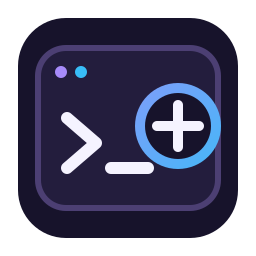

<div align="center">



# dotnet-cli-plus

**Solution operations beyond the standard .NET CLI.**

[](#development)
[](#development)

</div>

`dotnet-cli-plus` is an experimental .NET tool for solution operations that are not covered by the standard `dotnet` commands. Its current command adds an existing directory hierarchy to a solution as nested solution folders.

The tool targets .NET 10 and reads and writes both classic `.sln` files and XML `.slnx` files.

## Development

Enter the pinned Nix development shell and restore the repository tools:

```console
nix develop
dotnet tool restore
```

Build and test the SLNX solution:

```console
dotnet build
dotnet test
dotnet csharpier check .
```

## Usage

Pack and install the tool from the repository:

```console
dotnet pack --configuration Release
dotnet tool install --global --add-source ./build Dotnet.CLI.Plus
```

Add a directory hierarchy to a solution:

```console
dotnet plus sln ./ add directory src/tools
```

The target directory must exist inside the directory containing the selected solution. When a directory path contains multiple solution files, specify the `.sln` or `.slnx` file explicitly.
